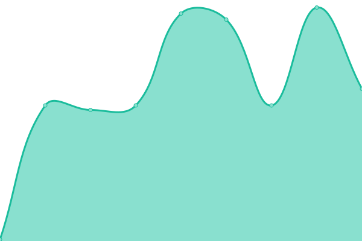
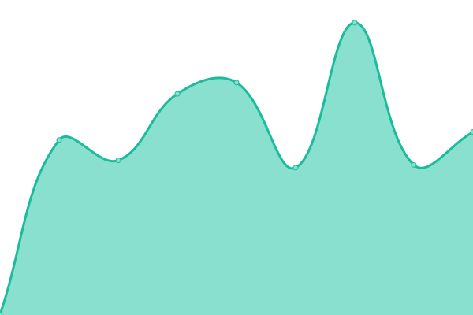
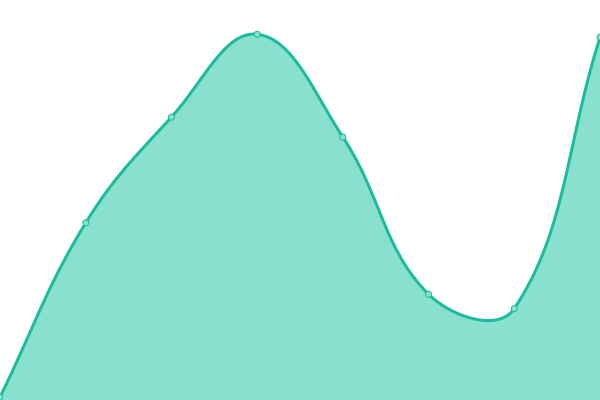

# [📈 Live Status](https://status.minicraft-server.de): <!--live status--> **🟧 Partial outage**

This repository contains the open-source uptime monitor and status page for [MiniCraft Server](https://minicraft-server.de), powered by [Upptime](https://github.com/upptime/upptime).

With [Upptime](https://upptime.js.org), you can get your own unlimited and free uptime monitor and status page, powered entirely by a GitHub repository. We use [Issues](https://github.com/minicraftserver/status/issues) as incident reports, [Actions](https://github.com/minicraftserver/status/actions) as uptime monitors, and [Pages](https://status.minicraft-server.de) for the status page.

<!--start: status pages-->
<!-- This summary is generated by Upptime (https://github.com/upptime/upptime) -->
<!-- Do not edit this manually, your changes will be overwritten -->
<!-- prettier-ignore -->
| URL | Status | History | Response Time | Uptime |
| --- | ------ | ------- | ------------- | ------ |
|  [MiniCraft Server](sv1xapp01-p.timschneider.info) | 🟩 Up | [mini-craft-server.yml](https://github.com/minicraftserver/status/commits/HEAD/history/mini-craft-server.yml) | 

 94ms
     
 | 

<a href="https://status.minicraft-server.de/history/mini-craft-server">96.64%</a>
    

|  [MiniCraft TeamSpeak](sv1xapp01-p.timschneider.info) | 🟩 Up | [mini-craft-team-speak.yml](https://github.com/minicraftserver/status/commits/HEAD/history/mini-craft-team-speak.yml) | 

 99ms
     
 | 

<a href="https://status.minicraft-server.de/history/mini-craft-team-speak">100.00%</a>
    

|  [MiniCraft Webseite](https://minicraft-server.de) | 🟥 Down | [mini-craft-webseite.yml](https://github.com/minicraftserver/status/commits/HEAD/history/mini-craft-webseite.yml) | 

 783ms
     
 | 

<a href="https://status.minicraft-server.de/history/mini-craft-webseite">99.99%</a>
    

|  [Mojang Sessionserver](https://sessionserver.mojang.com) | 🟩 Up | [mojang-sessionserver.yml](https://github.com/minicraftserver/status/commits/HEAD/history/mojang-sessionserver.yml) | 

 48ms
     
 | 

<a href="https://status.minicraft-server.de/history/mojang-sessionserver">100.00%</a>
    

|  [Mojang API Endpoints](https://api.minecraftservices.com) | 🟩 Up | [mojang-api-endpoints.yml](https://github.com/minicraftserver/status/commits/HEAD/history/mojang-api-endpoints.yml) | 

 82ms
     
 | 

<a href="https://status.minicraft-server.de/history/mojang-api-endpoints">100.00%</a>
    

<!--end: status pages-->

[**Visit our status website →**](https://status.minicraft-server.de)

## 📄 License

- Powered by: [Upptime](https://github.com/upptime/upptime)
- Code: [MIT](./LICENSE) © [Anand Chowdhary](https://anandchowdhary.com), supported by [Pabio](https://pabio.com)
- Data in the `./history` directory: [Open Database License](https://opendatacommons.org/licenses/odbl/1-0/)
